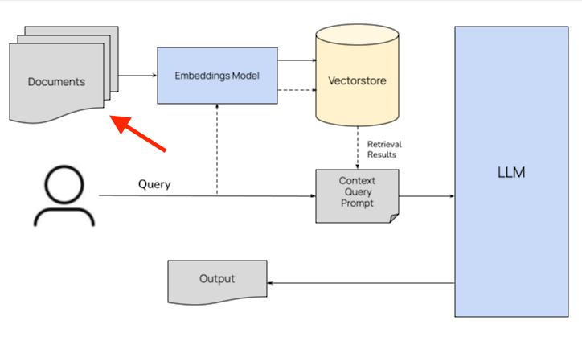

# Retrieval-Augmented Generation (RAG) Application

This repository implements a Retrieval-Augmented Generation (RAG) pipeline leveraging **LangChain**, **FAISS**, and **OpenAI**. The goal is to build a language model application that retrieves relevant contextual information from a custom document store to enhance generation quality and accuracy.

---

## Architecture Overview

The system is organized into three core phases:

1. **Ingestion**  
   Load raw documents, split them into smaller chunks, embed each chunk using OpenAI embeddings, and store these embeddings in a FAISS vector database.

2. **Retrieval**  
   Convert user queries into embeddings, perform similarity search on the FAISS vector store to retrieve the most relevant document chunks.

3. **Generation**  
   Feed the retrieved documents along with the user query into the OpenAI language model to generate a context-aware response.

---

## Architecture Diagram



> *Replace the above path with your actual image location.*

---

## Setup & Usage

### 1. Install dependencies

```bash
pip install -r requirements.txt
